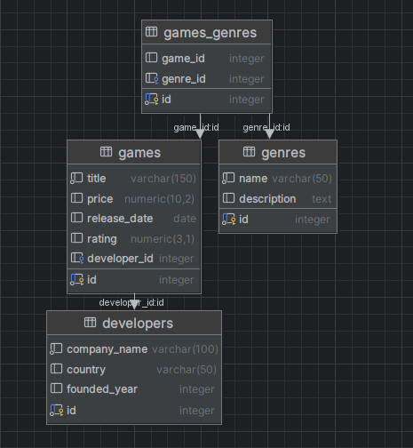

# 🎮 GameVault: İlişkisel Oyun Veritabanı Projesi

**SQL_GameVault**, modern bir oyun kütüphanesinin arka planındaki veri mimarisini modelleyen, ilişkisel bir veritabanı projesidir. Proje; oyunlar, geliştiriciler ve türler arasındaki karmaşık bağları (One-to-Many ve Many-to-Many) yönetmek, dinamik fiyat analizleri yapmak ve veri bütünlüğünü korumak amacıyla tasarlanmıştır.

---

## 🏗️ Veritabanı Mimarisi

Sistem, veri tutarlılığını en üst düzeyde tutmak için 4 temel tablo üzerine inşa edilmiştir:

* **`developers`**: Geliştirici firmaların bilgilerini tutar.
* **`games`**: Oyunların fiyat, puan ve çıkış tarihi gibi teknik verilerini saklar.
* **`genres`**: Oyun kategorilerini tanımlar.
* **`games_genres`**: Oyunlar ve Türler arasındaki **Many-to-Many** ilişkiyi sağlayan köprü tablodur.

### 🛡️ Öne Çıkan Teknik Özellikler
* **ON DELETE CASCADE:** Ana tablodan bir oyun silindiğinde, ona bağlı tüm alt verilerin (tür eşleşmeleri vb.) otomatik olarak temizlenmesini sağlar.
* **Relational Mapping:** Gelişmiş `INNER JOIN` sorguları ile tablolar arası veri akışı optimize edilmiştir.
* **Data Integrity:** `PRIMARY KEY` ve `FOREIGN KEY` yapıları ile yetim kayıt (orphan records) oluşumu engellenmiştir.

---

## 🔍 Örnek Sorgu Yetenekleri

Proje içerisinde aşağıdaki raporlama ve işlem senaryoları uygulanmıştır:
- [x] Tüm oyunları geliştirici isimleriyle birlikte listeleme.
- [x] Sadece belirli bir türe (Örn: **RPG**) ait oyunları puan bazlı filtreleme.
- [x] Fiyatı belirli bir limitin üzerindeki oyunları pahalıdan ucuza sıralama.
- [x] `LIKE` operatörü ile akıllı metin arama (İsminde "War" geçen oyunlar vb.).
- [x] Veritabanı genelinde %10 toplu fiyat güncellemesi.

---

## 🖼️ Veritabanı Şeması

Tablolar arasındaki ilişkileri görsel olarak buradan inceleyebilirsiniz:

---

## 📂 Dosya İçeriği

Proje, hem hızlı kurulum hem de modüler inceleme için aşağıdaki yapıya göre organize edilmiştir:

| 📄 Dosya / Klasör | 🛠️ Açıklama |
| :--- | :--- |
| **`Extras/`** | Veritabanı yönetim süreçlerini adım adım içeren modüler SQL klasörü. |
| ∟ `1-Tables.sql` | Şema tasarımı, Tablo oluşturma ve Kısıtlamaların (Constraints) tanımlanması. |
| ∟ `2-Datas.sql` | Geliştirici, Oyun ve Tür verilerinin sisteme ilk girişi. |
| ∟ `3-Update-Delete.sql` | Veri manipülasyonu, toplu indirimler ve `CASCADE` silme senaryoları. |
| ∟ `4-Reports.sql` | `JOIN` operasyonları ve Many-to-Many ilişkileri içeren gelişmiş analiz raporları. |
| **`All-in-one-query.sql`** | Tüm veritabanı sürecini (kurulumdan raporlamaya) tek seferde çalıştıran ana betik. |
| **`Diagram-Datagrip.png`** | Veritabanı mimarisini ve tablolar arası fiziksel bağları gösteren ER Diyagramı. |

---

## 👤 Hazırlayan

**Yasin Yıldırım** 📧 [yasinyildirim.work@gmail.com](mailto:yasinyildirim.work@gmail.com)  
🔗 [GitHub Profilim](https://github.com/yasin-yildirim-statistics)

---
⭐ *Bu veritabanı mimarisi projelerinizde size yardımcı olduysa bir yıldız bırakmayı unutmayın!*
